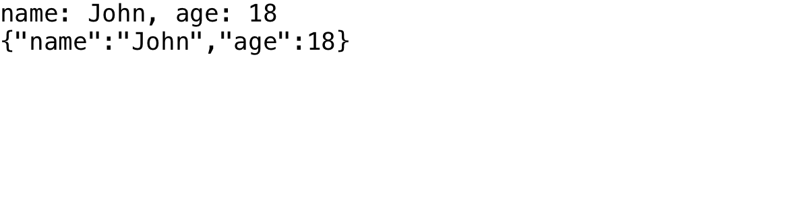

## Initial use

宣传功效如此好的一个开源项目，在阅读其源代码欣赏其设计前确实有必要进行一些初步的体验。

本次体验主要使用Eclipse IDE辅助完成。

[参考资料1](https://842376130.gitbook.io/fastjson-learning-report/di-yi-zhang-fastjson-man-you)的例子很简洁，我也偷个懒，在Eclipse中直接先用这份代码中的例子上手跑一跑看看效果。

我的完整代码：

```java
import com.alibaba.fastjson.JSONObject; 

public class test {
	public static void main(String[] args) {
		String jobjstr = "{" +
			    "\"name\": \"John\"," +
			    "\"age\": 18" +
			    "}";
		JSONObject jobj = JSONObject.parseObject(jobjstr);
		System.out.println("name: " + jobj.getString("name") +
		    ", age: " + jobj.getInteger("age"));
		String str = jobj.toJSONString();
		System.out.println(str);
	}
	
}
```

**运行结果**



示例代码很简洁，根据上一章介绍过的Json格式规范（以及直观感受）可以看出，jobjstr存储的json内定义了name的值为John，age的值为18。通过调用fastjson提供的JSONObject类parseObject方法，我们得到了一个包含以上信息的JSONObject。相反地，通过调用JSONObject的toJSONString，我们还可以把一个JSONObject转换回等价的字符串。

### fastjson内的探索

以上是fastjson提供的最基础最本质的功能，也是我们研究它的起点。

Eclipse提供了打开函数声明的功能，但由于我在Eclipse中导入的是jar包，不含源代码信息，这个功能并不能正常使用。所以不如干脆打开VS Code直接看相应实现。

#### parseObject\(\)

在JSON.java文件的JSON类中，可以找到parseObject\(\)方法的多个重载实现：

```java
    public static JSONObject parseObject(String text, Feature... features) {
        return (JSONObject) parse(text, features);
    }

    public static JSONObject parseObject(String text) {
        ...
    }
    public static <T> T parseObject(String text, TypeReference<T> type, Feature... features) {
        return (T) parseObject(text, type.type, ParserConfig.global, DEFAULT_PARSER_FEATURE, features);
    }
    ... 后面还有很多重载实现，这里不一一列举了
```

普通用户使用时几乎只需要关心JSON这一大类提供的功能而不必深究每一个内部功能实现时需要哪些类协同工作，这充分体现了面向对象的封装思想。
在上文的简单例子中使用的重载实现是参数非常简单的一个版本：

```java
public static JSONObject parseObject(String text) {
    return parse(text, DEFAULT_PARSER_FEATURE);
}
```

这次调用的parse方法是众多重载版本中的这个：

```java
public static Object parse(String text, int features) {
    return parse(text, ParserConfig.getGlobalInstance(), features);
}
```

此处的DEFAULT_PARSER_FEATURE为一些默认开启的特性，配置在JSON.java的78-88行，开启了AutoCloseSource、InternFieldNames、UseBigDecimal、AllocUnQuotedFieldNames、AllowSingleQuotes、AllowArbitaryCommas、SortFeidFastMatch、IgnoreNotMatch特性。

我们继续深挖parse方法，发现它又调用了一次重载的自己。。。

```java
public static Object parse(String text, int features) {
    return parse(text, ParserConfig.getGlobalInstance(), features);
}
```

这次调用的重载版本是

```java
    public static Object parse(String text, ParserConfig config, int features) {
        if (text == null) {
            return null;
        }

        DefaultJSONParser parser = new DefaultJSONParser(text, config, features);
        Object value = parser.parse();

        parser.handleResovleTask(value);

        parser.close();

        return value;
    }
```
如此众多的重载版本，最终真正用于调用其他类实现所需功能的，其实只是其中参数相对较全的一个重载版本，其他重载方法事实上在类内充分复用了代码。

这次引入了一个ParserConfig类的config实例，这个类也比较复杂，我们只关注当前需要的部分。getGlobalInstance方法很简洁，直接返回了一个定义好的global变量，而global仅仅是new出来的一个ParserConfig变量，一切默认。此处fastjson再次发扬了我调我自己的优良传统，有很深的调用树，我们暂时就不关注了。

回头看parse方法。这次我们遇到的是一个有些“实际”功能的重载版本。首先对text做必要的安全性检查，然后生成了一个DefaultJSONParser的实例，用value去存储这个实例parse后的结果并关闭parer，返回。

这里的DefaultJSONParser类又是何方神圣呢？我在parser\/DefaultJSONParser.java找到了答案。这里调用的版本又遵循优良传统调用了它自己的另一重载版本。

```java
    public DefaultJSONParser(final String input, final ParserConfig config, int features){
        this(input, new JSONScanner(input, features), config);
    }
```

```java
    public DefaultJSONParser(final Object input, final JSONLexer lexer, final ParserConfig config){
        this.lexer = lexer;
        this.input = input;
        this.config = config;
        this.symbolTable = config.symbolTable;

        int ch = lexer.getCurrent();
        if (ch == '{') {
            lexer.next();
            ((JSONLexerBase) lexer).token = JSONToken.LBRACE;
        } else if (ch == '[') {
            lexer.next();
            ((JSONLexerBase) lexer).token = JSONToken.LBRACKET;
        } else {
            lexer.nextToken(); // prime the pump
        }
    }

```

好在，这次的自我调用深度没之前那么丧心病狂。可以看到这里我们使用传入的JSONScanner作为语法分析器，使用我们从最初传递进来的text作为输入，使用默认设置的config及默认的符号表。DefaultJSONParser类被JSON类调用，而它又调用了JSONScanner的实例以提供lexer功能，与这两个类之间均形成了依赖关系。

而如果我们再看一看DefaultJSONParser类的成员变量，会发现其成员变量中存在JSONLexer、ParserConfig、ParseContext类的实例，这一设计反应了典型的聚合关系。

而回到parse本身，让我们来看一下parse方法的执行。

parse方法本身由多个switch-case构成，其中每个case都必定调用lexer.nextToken\(\)来让parse过程向后推进。针对当前获取到的token类型继续调用相应方法解析JSON所含内容。值得注意的是，最值得我们关注的Object结果就在该方法内形成。

```java
public Object parse(Object fieldName) {
        final JSONLexer lexer = this.lexer;
        switch (lexer.token()) {
            case SET:
                lexer.nextToken();
                HashSet<Object> set = new HashSet<Object>();
                parseArray(set, fieldName);
                return set;
            case TREE_SET:
                lexer.nextToken();
                TreeSet<Object> treeSet = new TreeSet<Object>();
                parseArray(treeSet, fieldName);
                return treeSet;
            case LBRACKET:
                JSONArray array = new JSONArray();
                parseArray(array, fieldName);
                if (lexer.isEnabled(Feature.UseObjectArray)) {
                    return array.toArray();
                }
                return array;
            case LBRACE:
            ... // 中部大量case省略
            case ERROR:
            default:
                throw new JSONException("syntax error, " + lexer.info());
        }
    }

```

这里我们选择其中的parseArray方法向下挖掘。
```java
public final void parseArray(final Collection array, Object fieldName) {
        final JSONLexer lexer = this.lexer;
        ...
        ParseContext context = this.context;
        this.setContext(array, fieldName);
        try {
            for (int i = 0;; ++i) {
                if (lexer.isEnabled(Feature.AllowArbitraryCommas)) {
                    while (lexer.token() == JSONToken.COMMA) {
                        lexer.nextToken();
                        continue;
                    }
                }
                Object value;
                switch (lexer.token()) {
                    case LITERAL_INT:
                        value = lexer.integerValue();
                        lexer.nextToken(JSONToken.COMMA);
                        break;
                    ...
                }

                array.add(value);
                checkListResolve(array);

                if (lexer.token() == JSONToken.COMMA) {
                    lexer.nextToken(JSONToken.LITERAL_STRING);
                    continue;
                }
            }
        } finally {
            this.setContext(context);
        }
    }
```

略去大量非关键信息后可以看到，其利用lexer提供的nextToken等方法解析array并将解析结果放入value中，随后value会被加入Collection实例array中，若需要进一步解析还会进入checkListResolve方法解析可能的List。

如果按照之前的执行路径到达这里，此处使用的JSONlexer其实是JSONScanner类的一个实例，JSONScanner类由JSONLexer经过两次继承得到（JSONLexer第一次继承得到JSONLexerBase抽象类，第二次得到JSONScanner类）。

其中，JSONLexer这一interface指明了Lexer需要实现的一些方法（常用的如next、nextToken），没有任何方法的实际实现。
JSONLexerBase抽象类中利用next方法实现了nextToken方法，但next方法本身的具体实现（实际从字符串中抽取字符）是在JSONScanner类中实现的。

这层层的抽象，既保证了上层API的相对稳定性（JSONLexer、JSONLexerBase里的内容可以较少改动而不对性能造成大的瓶颈）又保证了效率（JSONScanner里的内容可以在找到更优秀的实现方式后大量变动以优化性能）

#### toJSONString\(\)

回头看fastjson的反向功能-将一个Java Object转化为等价的JSON表示。

在JSON.java的JSON类中可以找到toJSONString的定义：

```java
/**
     * This method serializes the specified object into its equivalent Json representation. Note that this method works fine if the any of the object fields are of generic type,
     * just the object itself should not be of a generic type. If you want to write out the object to a
     * {@link Writer}, use {@link #writeJSONString(Writer, Object, SerializerFeature[])} instead.
     *
     * @param object the object for which json representation is to be created setting for fastjson
     * @return Json representation of {@code object}.
     */
    public static String toJSONString(Object object) {
        return toJSONString(object, emptyFilters);
    }
```

由上方提供的注释可知，它就是我们要找的toJSONString方法本尊。

不出意外，接受参数少的重载函数版本会添加默认参数调用参数更多的函数版本，层层累加默认参数直到参数数量足够为接下来所有功能的执行提供必要的信息。由于上文中我们已经看了足够多次类似方式的调用，在这里就不再详细分析调用过程及每次调用增加的参数。

```java
//调用轨迹（省略返回值类型等信息）
toJSONString(Object object)

toJSONString(Object object, SerializerFeature... features)

toJSONString(Object object, int defaultFeatures, SerializerFeature... features) {
        SerializeWriter out = new SerializeWriter((Writer) null, defaultFeatures, features);

        try {
            JSONSerializer serializer = new JSONSerializer(out);
            serializer.write(object);
            return out.toString();
        } finally {
            out.close();
        }
    }

```

本次调用深度没有JSON转换为Java Object的方法那么丧心病狂，在添加了两个参数后我们就看到了实质性解析的操作。可以看到，out用于序列化后的信息输出，serializer实际负责将object转化成SerializeWriter可接受的数据。

在serializer/JSONSerializer.java中可以找到JSONSerializer类的定义。给定SerializeWriter参数初始化的方法定义如下：

```java
    public JSONSerializer(SerializeWriter out){
        this(out, SerializeConfig.getGlobalInstance());
    }
```

进一步追踪发现其仅对类内的out和config赋值，没有其他多余操作。
那么我们自然可以猜测，主要的工作是在write方法完成的。

```java
    public final void write(Object object) {
        if (object == null) {
            out.writeNull();
            return;
        }

        Class<?> clazz = object.getClass();
        ObjectSerializer writer = getObjectWriter(clazz);

        try {
            writer.write(this, object, null, null, 0);
        } catch (IOException e) {
            throw new JSONException(e.getMessage(), e);
        }
    }
```

write方法中生成了一个Class<?>类型的clazz，这一用法之前我没有见过。查找[资料](https://stackoverflow.com/questions/9921676/what-does-class-mean-in-java)发现，Class包含了一个类所必须的信息，而<?>则表明该类没有指定类型。

从而我们可以看出，实际上fastjson首先将object转化为一个类，然后再利用类的信息辅助生成json相关结构。
接下来的try-catch内调用了ObjectSerializer类的write方法，其定义在serializer/ObjectSerializer.java中，但此处并没有给出相应的实现。向上一看，啊哈，原来这个ObjectSerializer是一个interface，默认情况下interface中的方法都是抽象而不含具体实现的。

不过这样也给我们带来了问题，方法的追踪线索就这么断了？

事实上当然不会。在SerializaWrite.java中不难找到，
